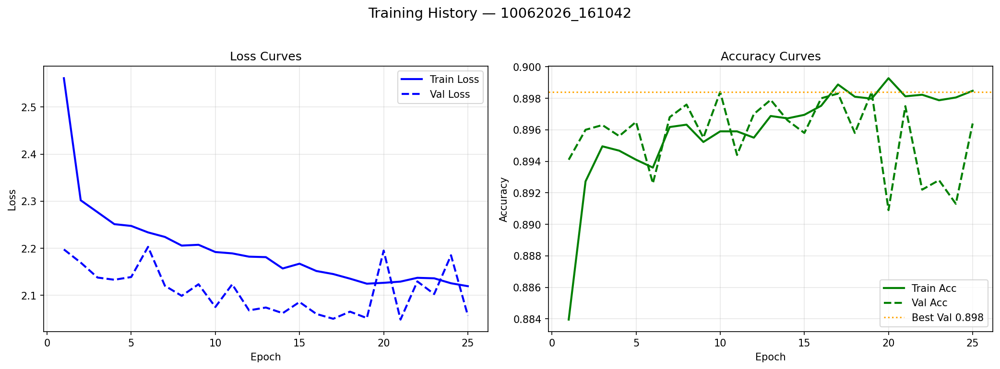
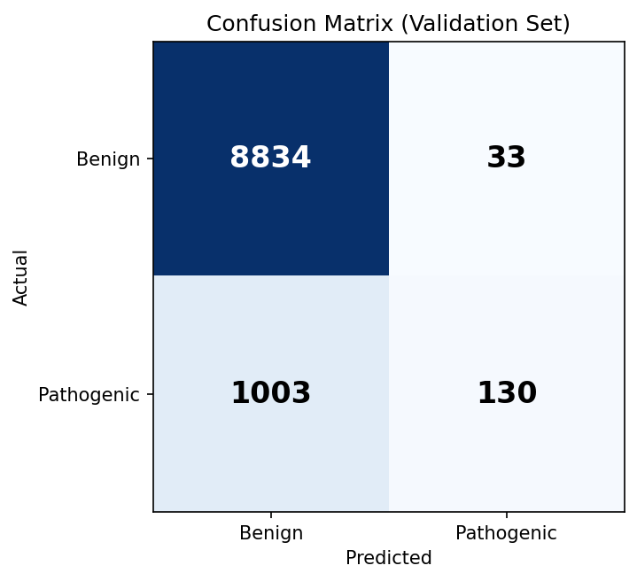
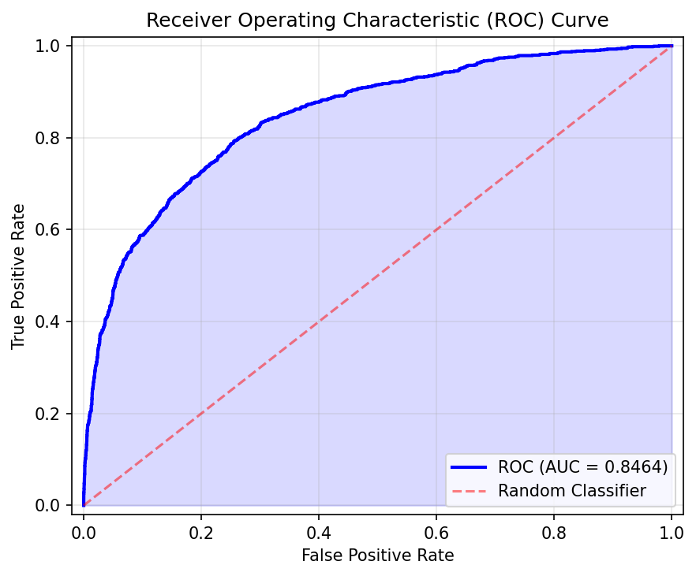
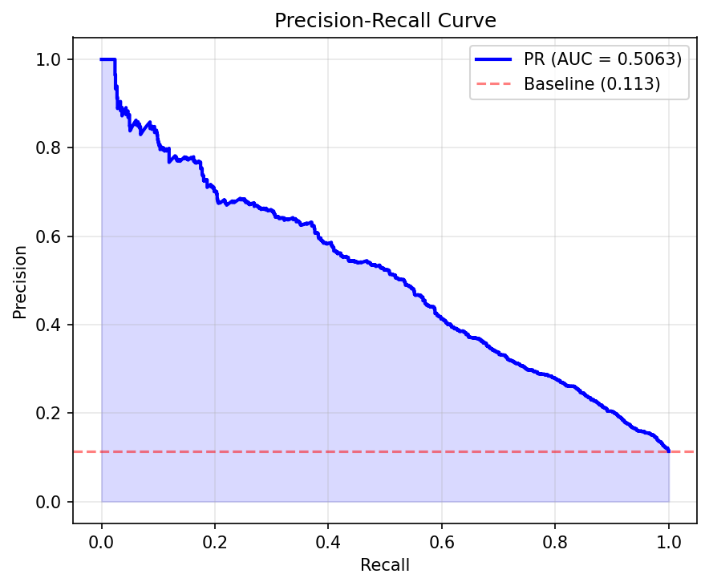
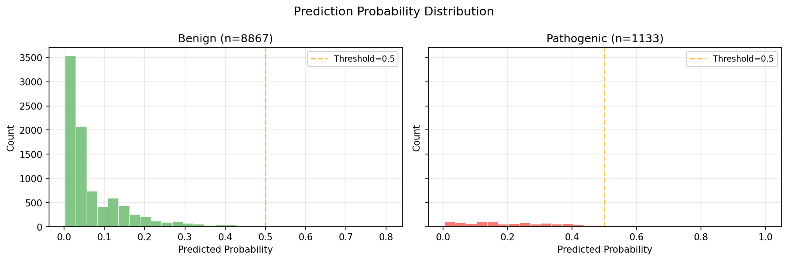
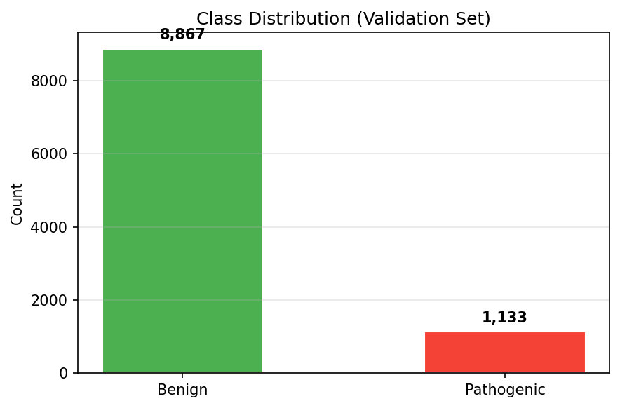

# Cancer Detector

Deep learning-based system for detecting cancer-related genomic variants and classifying cancer types using ClinVar data. Built with PyTorch and Flask.

## Overview

The Cancer Detector trains a neural network on ClinVar-extracted genomic data to predict whether a genetic variant is cancer-related (pathogenic), then maps the result to specific cancer types using a curated gene-cancer database.

**Key capabilities:**
- Train a binary classifier on 4.5M+ ClinVar variant records
- Detect pathogenic variants from genomic features (position, gene, variant type, allele lengths)
- Predict specific cancer types with confidence percentages via gene mapping
- Interactive web UI for training, detection, and visualization
- REST API for programmatic access
- Batch CSV processing for large-scale analysis

## Project Structure

```
Cancer_Detector/
├── app.py                  # Flask web application (routes, UI)
├── detect_cancer.py        # Cancer detection & type classification engine
├── features.py             # Feature extraction from genomic variants
├── trainer.py              # PyTorch neural network training pipeline
├── requirements.txt        # Python dependencies
├── test_variants.csv       # Sample test data
├── clinvar_extracted.csv   # Main ClinVar dataset (not included in repo)
├── batch_results_*.csv     # Batch detection output files
├── output_clinvar/         # Trained models, configs, and charts
│   ├── clinvar_model_*.pt  # Trained PyTorch model checkpoints
│   ├── config_*.json       # Training configuration files
│   └── charts/             # Training visualization charts
└── templates/              # Flask HTML templates
    ├── base.html           # Base layout template
    ├── index.html          # Home page
    ├── train.html          # Training configuration page
    ├── detect.html         # Single variant detection page
    ├── stats.html          # Dataset statistics
    ├── models.html         # Model management
    ├── chart_gallery.html  # Training charts gallery
    └── api_docs.html       # API documentation
```

## Installation

### Prerequisites
- Python 3.10+
- pip
- (Optional) CUDA-capable GPU for faster training

### Setup

1. Clone the repository:
```bash
git clone https://github.com/datbuiquoc035/Cancer_Detector.git
cd Cancer_Detector
```

2. Create a virtual environment:
```bash
python -m venv .venv
# Windows:
.venv\Scripts\activate
# macOS/Linux:
source .venv/bin/activate
```

3. Install dependencies:
```bash
pip install -r requirements.txt
```

> **Note:** The `clinvar_extracted.csv` file is not included in the repository. See the [Dataset Preparation](#dataset-preparation) section below.

## Dataset Preparation

The dataset (`clinvar_extracted.csv`) is a large file (~4.5 million rows, ~299 columns) that must be obtained separately.

### Option 1: Download from ClinVar
1. Go to [NCBI ClinVar FTP](https://ftp.ncbi.nlm.nih.gov/pub/clinvar/tab_delimited/)
2. Download `variant_summary.txt.gz`
3. Extract it and preprocess it to match the required columns:
   - `VariationID`, `CHR_GRCh38`, `Start_GRCh38`, `Stop_GRCh38`
   - `VariationType`, `GeneSymbol`, `Ref_Allele`, `Alt_Allele`
   - `Clinical_Significance`

### Option 2: Use a Subset (Demo)
A small test file `test_variants.csv` is included for quick testing.

## Usage

### 1. Start the Web Application

```bash
python app.py
```

Open http://localhost:5000 in your browser.

### 2. Train a Model

Navigate to the **Train** page (http://localhost:5000/train):

**Configuration options:**
| Parameter | Default | Description |
|-----------|---------|-------------|
| Epochs | 5 | Number of training epochs |
| Batch Size | 64 | Samples per batch |
| Learning Rate | 0.001 | Adam optimizer learning rate |
| Dropout | 0.3 | Dropout rate for regularization |
| Validation Split | 0.2 | Fraction of data for validation |
| Hidden Dimensions | 128,64,32 | Neural network layer sizes |
| Scheduler | ReduceLROnPlateau | Learning rate scheduler type |
| Gradient Clip | 1.0 | Maximum gradient norm |
| Class Weights | Yes | Balance positive/negative classes |
| Sample Size | 50000 | Number of variants to sample |

Training generates real-time charts (loss curves, confusion matrix, ROC curve, precision-recall curve, probability distribution).

### 3. Detect Cancer in a Variant

Navigate to the **Detect** page (http://localhost:5000/detect) and enter variant details:

- **Chromosome** (e.g., 17 for BRCA1)
- **Position** (genomic position)
- **Gene** (e.g., BRCA1, EGFR, TP53)
- **Variant Type** (Missense, Frameshift, SNP, etc.)
- **Ref/Alt Alleles**
- **Clinical Significance** (optional)

The system returns:
- Cancer probability (%)
- Risk level (LOW / MEDIUM / HIGH)
- Whether the variant is predicted pathogenic
- Specific cancer type predictions with confidence percentages

### 4. Batch Detection (CSV)

Upload a CSV file with columns: `Chromosome`, `Position`, `Gene`, `Variant_Type`, `Ref_Allele`, `Alt_Allele`

Results include: Cancer probability, risk level, top predicted cancer type with confidence.

### 5. REST API

```bash
curl -X POST http://localhost:5000/api/detect \
  -H "Content-Type: application/json" \
  -d '{
    "chromosome": "17",
    "position": 43044295,
    "gene": "BRCA1",
    "variant_type": "Missense",
    "ref_allele": "G",
    "alt_allele": "A",
    "clinical_significance": "Pathogenic"
  }'
```

## Cancer Gene Database

The system includes a curated database of ~60 cancer-related genes, each mapped to associated cancer types with confidence scores:

| Gene | Associated Cancers | Confidence |
|------|-------------------|------------|
| **BRCA1** | Breast, Ovarian, Pancreatic, Prostate | 70-95% |
| **BRCA2** | Breast, Ovarian, Prostate, Pancreatic | 75-95% |
| **TP53** | Breast, Ovarian, Lung, Colorectal, Liver, Gastric, Bladder, Pancreatic | 70-85% |
| **EGFR** | Lung Adenocarcinoma | 90-95% |
| **APC** | Colorectal, FAP | 95-98% |
| **KRAS** | Lung, Colorectal, Pancreatic | 85-90% |
| **VHL** | Renal Cell Carcinoma | 95% |
| **MLH1/MSH2/MSH6** | Colorectal, Lynch Syndrome, Endometrial | 85-95% |
| **BRAF** | Colorectal, Melanoma | 85-90% |
| **CDH1** | Gastric, Hereditary Diffuse Gastric | 90-95% |

Full list in `detect_cancer.py:CANCER_GENE_DATABASE`.

## Model Architecture

The neural network (`ClinVarNet`) is a feedforward architecture:

```
Input (8 features) → Linear → BatchNorm → ReLU → Dropout
  → Linear(128) → BatchNorm → ReLU → Dropout
  → Linear(64) → BatchNorm → ReLU → Dropout
  → Linear(32) → BatchNorm → ReLU → Dropout
  → Linear(1) → Sigmoid → Output (cancer probability)
```

**Features used:**
- `VariationID` (numeric)
- `CHR_GRCh38` (numeric)
- `Start_GRCh38` (numeric)
- `Stop_GRCh38` (numeric)
- `VariationType` (categorical, label-encoded)
- `GeneSymbol` (categorical, label-encoded)
- `Ref_Allele` length (numeric)
- `Alt_Allele` length (numeric)

## Training Visualizations

The system generates 6 chart types after training. Below are results from the latest training run (40 epochs, 50K samples):

| Metric | Value |
|--------|-------|
| Accuracy | 89.64% |
| Best Validation Accuracy | 89.84% |
| AUC | 0.8464 |
| F1-Score | 0.2006 |
| PR-AUC | 0.5063 |

### Loss & Accuracy Curves(from model trained in 10/06/2026)


### Confusion Matrix


### ROC Curve


### Precision-Recall Curve


### Prediction Probability Distribution


### Class Distribution


## Command-Line Usage

Run detection directly without the web interface:

```bash
python -c "
from detect_cancer import ClinVarCancerDetector
detector = ClinVarCancerDetector()

result = detector.detect(
    chromosome='17',
    position=43044295,
    gene='BRCA1',
    variant_type='Missense',
    ref_allele='G',
    alt_allele='A',
    clinical_significance='Pathogenic'
)
detector.print_detailed_report(result)
"
```

## Technical Notes

- **Imbalanced data:** The dataset is imbalanced (~5-10% pathogenic vs benign). The trainer uses class-weighting in the loss function to handle this.
- **Early stopping:** Training stops automatically if validation accuracy does not improve for 15 epochs.
- **GPU support:** Automatically detects CUDA (NVIDIA), MPS (Apple Silicon), or falls back to CPU.
- **Memory efficient:** Uses streaming CSV reading to handle large datasets without loading everything into RAM.
